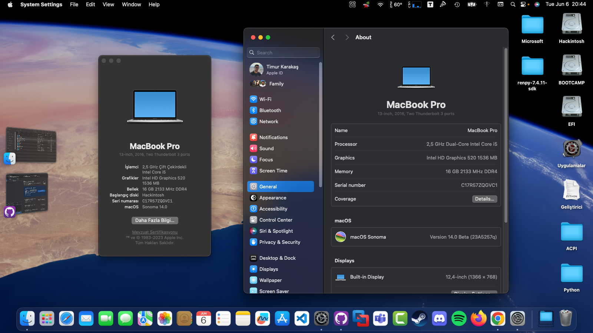

# Lenovo-X270-Hackintosh-Ventura-OpenCore-0.9.2

## Please make sure the SMBIOS is MacBookPro14,1 when installing Ventura

# Update History
- [x] 12.7.1

# Laptop's Hardware
- <b>Model</b>: Thinkpad X270
- <b>CPU</b>: Intel(R) Core(TM) i5-6200U CPU @ 2.30GHz
- <b>GPU</b>: Intel HD Graphics 520
- <b>RAM</b>: 8 GB 2666 DDR4
- <b>Screen</b>: 12,4" (1366x768)
- <b>Wi-Fi</b>: AC-8260
- <b>Camera</b>: 720p
- <b>Battery</b>: 3-cell with inside battery 

# Bios settings

<b>Security</b>
- `Security Chip` **Disabled**
- `Memory Protection -> Execution Prevention` **Enabled**
- `Virtualization -> Intel Virtualization Technology` **Enabled**
- `Virtualization -> Intel VT-d Feature` **Enabled**
- `Anti-Theft -> Computrace -> Current Setting` **Disabled**
- `Secure Boot -> Secure Boot` **Disabled**
- `Intel SGX -> Intel SGX Control` **Disabled**
- `Device Guard` **Disabled**

<b>Startup</b>
- `UEFI/Legacy Boot` **UEFI Only**
- `CSM Support` **No**

# What's Working?
- [x] Intel HD 520 Graphics (incuding graphics acceleration)
- [x] CPU Power Management
- [x] Battery
- [x] All USB ports
- [x] HDMI port (including HDMI Audio)
- [x] Intel Ethernet port
- [x] Realtek Audio (including headphones jack)
- [x] Internal camera (including Facetime)
- [x] Trackpad (Clicking works, but all physical buttons detect right clicks.)
- [x] Shutdown / Reboot 
- [x] Keyboard (incuding all fn Keys)
- [x] Wi-Fi & Bluetooth (including Apple services)
- [x] iMessage, FaceTime, App Store, iTunes Store (with valid smbios)
- [x] DRM support (iTunes Movies, Apple TV+, Amazon Prime and Netflix, and others)
- [x] SD Card Reader (v2.2 works but still a bit unstable)
- [x] Sleep / Wake (lid sleep and lid wake) (works for me you can try for yourself)

# What's not working ⚠️
- [x] Everything looks perfect for now 

